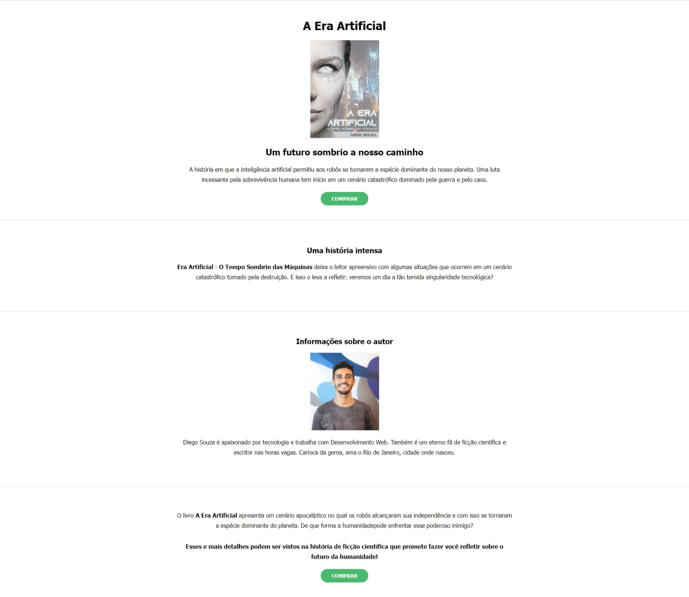

# 🚀 Página de Divulgação do Livro: A Era Artificial

O projeto foi realizado no Guia de CSS da DevMedia

## 🚀 Sobre o projeto

O projeto é uma página para a divulgação do livro A Era Artificial, de Diego Souza. A página contém uma breve descrição da narrativa e links para a página de compra do livro.

## 🚀 Ferramentas Utilizadas
O projeto foi feito com as seguintes tecnologias

- HTML para a estrutura da página
- CSS para a estilização